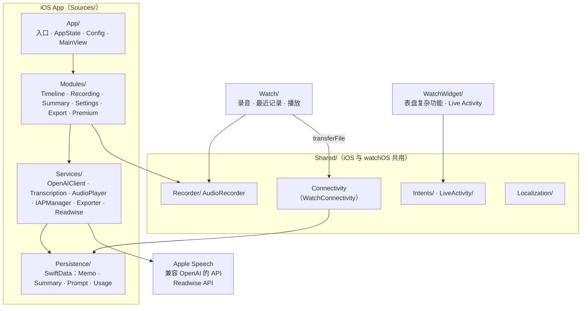
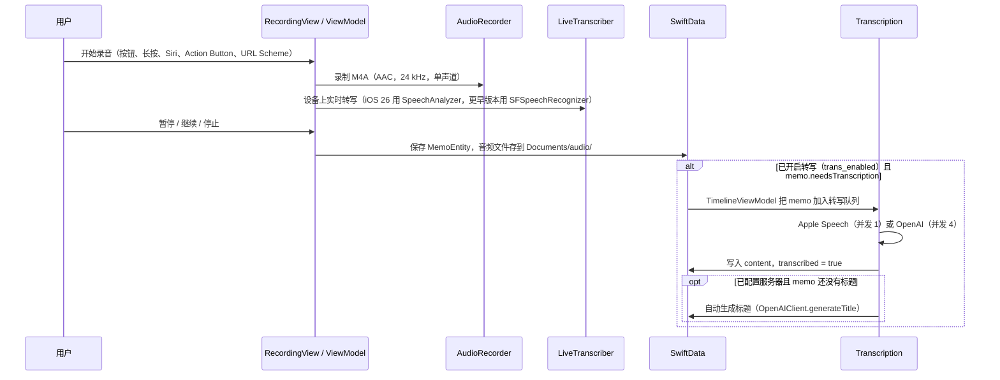
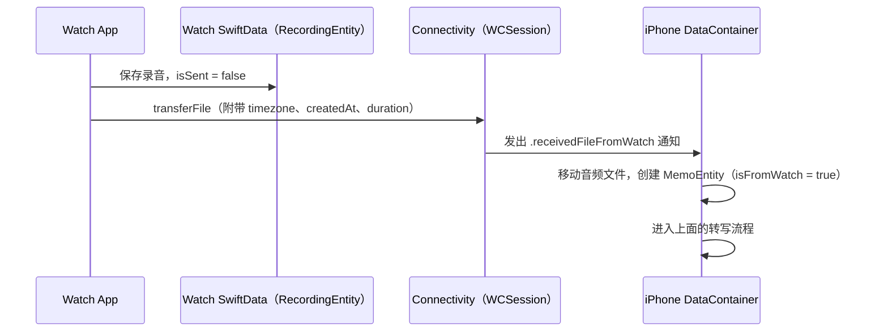
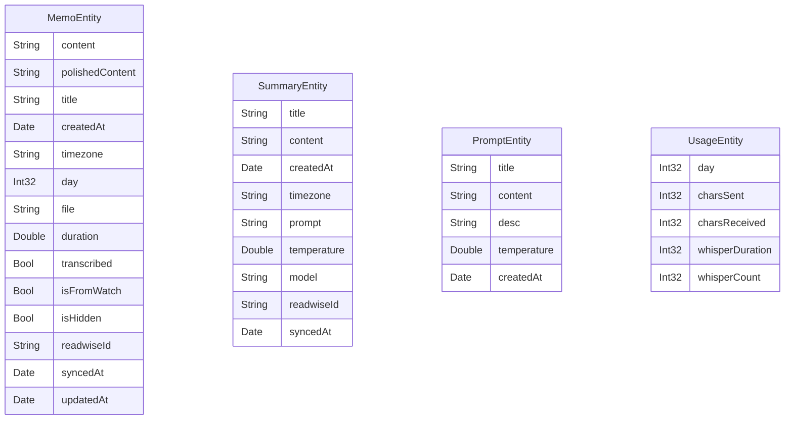
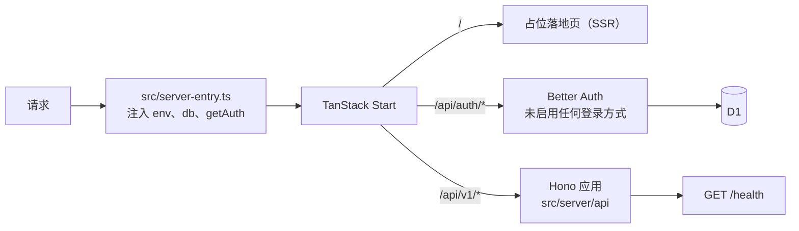

# Murmurs 架构

本文档说明 Murmurs **当前代码**的结构和运行方式，供开发者和 agent 修改代码前阅读。每当结构性改动落地，都要同步更新本文档。

- **目标架构**（多端、Cloudflare 后端、同步）的决策记录在 [`adr/`](../adr/)（ADR-0001 至 ADR-0014）。
- **实施顺序**见 [roadmap.md](./roadmap.md)。
- **功能规格**见 [`openspec/specs/`](../openspec/specs/)。

## 系统概览

仓库是一个 monorepo（[ADR-0013](../adr/0013-monorepo-in-existing-repository.md)）：

| 目录 | 现状 |
|---|---|
| `apple/` | 已上线的**单机版** iOS 和 watchOS 应用。所有数据都存在设备本地；转写、润色、标题和总结由客户端直接调用 Apple Speech 或兼容 OpenAI 的 API 完成 |
| `web/` | Cloudflare Worker **骨架**：占位的 Web 页面和 `/api/v1`（目前只有 `GET /health`），登录尚未开放，见 [Web 与 API](#web-与-apiweb) |
| `contract/` | 由 API 代码生成的 OpenAPI 契约及其检查脚本，见 [API 契约](#api-契约contract) |
| `l10n/` | Apple 和 Web 共用的文案源文件与生成器，见 [本地化](#本地化l10n) |

下面几节先说明 Apple 应用（除特别说明外，路径都相对于 `apple/`），再说明 Web、契约和本地化。

**Apple 应用概要：**

| 项目 | 值 |
|---|---|
| Bundle ID | `com.tangyue.murmurs` |
| 最低版本 | iOS 18.0 / watchOS 11.0（[ADR-0008](../adr/0008-minimum-ios-18-watchos-11.md)） |
| UI | SwiftUI；文本编辑和分享面板桥接 UIKit（[ADR-0007](../adr/0007-swiftui-first-with-uikit-bridging.md)） |
| 状态管理 | MVVM，ViewModel 是 `@Observable` 类 |
| 本地存储 | SwiftData |
| 构建 | XcodeGen（`project.yml`）、SPM、Fastlane |



## Targets

| Target | 类型 | 平台 | 源码 |
|---|---|---|---|
| `Murmurs` | 应用 | iOS | `Sources/`、`Shared/`、`Resources/` |
| `MurmursWidget` | 扩展 | iOS | `WatchWidget/`、`Shared/LiveActivity/`（Live Activity 和灵动岛） |
| `MurmursWatch` | 应用 | watchOS | `Watch/`、`Shared/` |
| `MurmursWatchWidget` | 扩展 | watchOS | `WatchWidget/`（表盘复杂功能：`accessoryCircular`、`accessoryCorner`） |
| `MurmursTests` | 单元测试 | iOS | `Tests/`（mock 放在 `Tests/Mocks/`） |
| `SnapshotTests` | UI 测试 | iOS | `SnapshotTests/`，使用 `Snapshot` 构建配置 |

## 目录结构

`apple/` 的内容：

```text
Sources/                 iOS 主应用
├── App/                 入口、AppState、Config、Constants、MainView（Timeline 和 Summary 两个标签页）
├── Modules/             功能模块（MVVM）
│   ├── Timeline/        memo 列表、日历、搜索、快速笔记、编辑
│   ├── Recording/       录音、暂停/继续、续录、录音完成页
│   ├── Summary/         多步骤生成总结、详情、编辑
│   ├── Settings/        服务器、prompt、Readwise、实验功能、关于
│   ├── Export/          CSV / Markdown 导出
│   └── Premium/         付费墙
├── Services/            OpenAI、Transcription、AudioPlayer、IAP、Export、Readwise、Protocols
├── Persistence/         DataContainer 与 SwiftData 实体
├── Models/              配置用的枚举（ChatModel、TranscriptionProvider 等）
└── Components/ Styles/ Helpers/ Extensions/
Shared/                  iOS 与 watchOS 共用：Recorder、Localization、Intents、LiveActivity、Connectivity
Watch/                   watchOS 应用（独立的 SwiftData 存储）
WatchWidget/             表盘复杂功能和 Live Activity 的 UI
Packages/                本地 SPM 包：XLog（日志）、XLang（运行时切换语言）
Tests/  SnapshotTests/   测试
fastlane/  Gemfile       发布与测试工具
```

仓库根目录另有 `web/`、`contract/`、`l10n/`、`openspec/`、`adr/`、`docs/`，以及运行 `rake l10n` 的 `Rakefile`。

## 核心流程

### 录音与转写



- **续录**：可以给已有的 memo 追加一段录音；追加后会清空由原内容生成的派生字段（润色、标题），然后重新处理。
- **幻觉过滤**：OpenAI 转写的结果如果和 `Transcription.hallucinationList` 里的某一项完全相同，就当作空结果丢弃。
- **Live Activity**：录音期间通过 `LiveActivityManager` 在灵动岛显示状态；`TogglePauseRecordingIntent` 和 `StopRecordingIntent` 提供暂停和停止按钮。

### AI 润色、标题与总结

所有 AI 调用都经过 `OpenAIClient`（`Sources/Services/OpenAI/`），直接请求用户配置的兼容 OpenAI 的服务（`Config.serverHost`，API Key 存在 Keychain）。

| 功能 | 方法 | 流式返回 | 结果写入 |
|---|---|---|---|
| 润色 | `polish(_:model:)` | 是 | `MemoEntity.polishedContent` |
| 标题 | `generateTitle(_:model:)` | 否 | `MemoEntity.title` |
| 总结 | `summarize(_:model:temperature:)` | 是 | `SummaryEntity` |
| 转写 | `transcribe(_:lang:model:)` | 否 | `MemoEntity.content` |

生成总结分几步：**选择 prompt → 选择或排除 memo → 预览完整消息（支持 `{{date}}` 占位符）→ 流式生成 → 保存**。总结用 MarkdownUI 渲染，也可以导出为 PDF（TPPDF）。

### Watch 同步到 iPhone



### Readwise

`TimelineViewModel` 和 `SummaryView` 调用 `Readwise` 服务（Readwise Reader API v3）保存 memo 和总结，并把返回的文档 ID 写回 `readwiseId`。开启 `readwise_auto_sync` 后，新 memo 在插入时、或转写完成后自动同步。token 存在 Keychain。

## 状态与配置

**`AppState`**（`@Observable`）：保存当前语言、麦克风权限、当前弹出的 sheet、当前标签页、`isPremium`，并处理 URL Scheme。

**`Config`**（`@AppStorage`，敏感值存在 Keychain）：

| 分组 | 键 |
|---|---|
| 通用 | `day_start_time`（默认 2 点）、`dark_mode`、`auto_save`、`hold_to_record_enabled` |
| 转写 | `trans_enabled`、`trans_provider`（`apple` / `openai`）、`trans_lang`、`trans_model` |
| AI | `sum_enabled`、`chat_model`（预设模型或自定义模型 ID）、`server_host`，以及 Keychain 里的 API Key |
| 实验功能 | `custom_whisper_prompt_enabled`、`custom_whisper_prompt`、`auto_start_on_startup` |
| Readwise | `readwise_sync_enabled`、`readwise_auto_sync`，以及 Keychain 里的 token |

**日期分界**：memo 的 `day` 按 `dayStartTime` 计算，默认凌晨 2 点前的录音归到前一天。

## 数据模型（SwiftData）

`DataContainer.shared` 在 `Application Support/DataModel.sqlite` 创建 `ModelContainer`；测试和预览时使用内存存储。



实体之间没有关系字段。Watch 端有自己的 SwiftData 存储，只有一个 `RecordingEntity`（`createdAt`、`file`、`duration`、`isSent`）。

## 付费与限额

- 通过 StoreKit 1（`SKPaymentQueue`）购买一次性商品 `com.tangyue.murmurs.premium`，购买状态存在 Keychain。
- 限额定义在 `Constants.Limit` 中：

| 限额 | 免费 | Premium |
|---|---|---|
| 每日 AI 字符数 | 20,000 | 100,000 |
| 自定义 prompt 数 | 3 | 不限 |
| 数据导出 | – | ✓ |

## 系统集成入口

| 入口 | 实现 |
|---|---|
| URL Scheme | `murmurs://record`、`murmurs://note`、`murmurs://note?text=…`、`murmurs://summarize`（`AppState`） |
| Siri、快捷指令、Action Button | `StartRecordingIntent` 加 `Shortcuts`（`Shared/Intents/`） |
| Live Activity、灵动岛 | `MurmursWidget` 扩展里的 `RecordingLiveActivity` |
| 表盘复杂功能 | `MurmursWatchWidget` 扩展里的 `MurmursStaticWidget` |

## Web 与 API（`web/`）

`web/` 基于 `react-tanstarter` 模板，是**一个** Cloudflare Worker（[ADR-0004](../adr/0004-single-worker-from-react-tanstarter.md)），同时提供 Web 页面和 API：



| 部分 | 说明 |
|---|---|
| API | `src/server/api/app.ts` 用 `@hono/zod-openapi` 构建，挂在 `/api/v1`；`src/routes/api/v1/$.ts` 把所有方法转发给它。API 代码不依赖 TanStack Start，原生客户端只调用 `/api/v1` |
| `GET /api/v1/health` | 返回 `{ status: "ok", version, environment }`，不需要登录 |
| 错误格式 | `{ "error": { "code", "message", "details"? } }`：未知路径 404 `not_found`，请求不符合 schema 时 400 `invalid_request`（`details.issues` 里是 zod 的校验问题），未处理异常 500 `internal_error`，不返回内部信息 |
| 登录 | Better Auth 已挂载在 `/api/auth/*`，但没有启用任何登录方式，也关闭了邮箱密码，所以注册和登录都会被拒绝。它在第一次访问时才创建，`/api/v1` 不依赖它的密钥 |
| 数据库 | D1 + Drizzle。schema 在 `src/lib/db/schema/`，迁移文件在 `drizzle/`（第一个迁移创建 Better Auth 的表），通过 `wrangler d1 migrations apply` 应用 |
| 环境 | `wrangler.toml` 顶层是本地开发（`ENVIRONMENT=development`），`[env.staging]` 和 `[env.production]` 各有独立的 Worker 名和 D1。staging 和 production 的 D1 id 与密钥要由账号所有者创建后填入 |
| 页面与文案 | 只有一个落地页；主题和语言切换沿用模板。文案来自 `l10n/`，语言为 `en` 和 `zh-Hans` |
| 测试 | Vitest 4 + `@cloudflare/vitest-pool-workers`，在 Workers 运行时里测试 `test/api-worker.ts`（只挂载 Hono 应用）以及休眠状态的 Better Auth |

## API 契约（`contract/`）

`contract/openapi.json`（OpenAPI 3.0.3）由 `pnpm --dir web contract:generate` 从 API 的 zod 路由定义生成，并提交进仓库（[ADR-0010](../adr/0010-openapi-contract-with-generated-clients.md)）。原生端构建时直接读取这个文件，不需要 Node 工具链。

| 脚本 | 作用 |
|---|---|
| `contract/scripts/check-drift.sh` | 重新生成并比较，文件过期时失败，并提示重新生成的命令 |
| `contract/scripts/check-breaking.sh` | 用 oasdiff 对比主分支上的契约，发现破坏性变更时失败（[ADR-0014](../adr/0014-api-v1-compatibility-policy.md)）；本机没有 oasdiff 时改用 Docker 镜像 |
| `contract/scripts/check-generators.sh` | 用 `swift-openapi-generator`（`contract/consumers/swift` 这个 SwiftPM 包）和 Kotlin `openapi-generator`（Docker）实际生成一次代码 |

错误码 `code` 在契约里是字符串而不是枚举，这样以后新增错误码时，生成的客户端不会因为遇到未知值而解码失败。

## 本地化（`l10n/`）

`l10n/Localizable.csv`（列：key、comment、platforms、en、zh-Hans）是 Apple 和 Web 文案的唯一来源。`platforms` 取 `apple`、`web` 或 `apple web`，Web 独有的 key 放在 `web.` 命名空间下。在仓库根目录运行 `rake l10n`（生成器是 `l10n/generate`，测试是 `l10n/test_generate.rb`）会生成：

- `apple/Shared/Localization/LocalizedKeys.swift` 和两种语言的 `.strings`：Swift 里用 `L(.key)` 引用，`XLang` 支持运行时切换语言
- `web/src/i18n/locales/en.json` 和 `zh-Hans.json`：按 `.` 嵌套；`%@`、`%d` 转成 i18next 的 `%{0}`、`%{1}`，所以 prompt 模板里的字面量 `{{date}}` 不会被当成插值

分节注释行（如 `# Plist #`）不生成 key；缺翻译时生成器会报出来，并回退到英文。

## 构建与 CI

| 配置 | 用途 |
|---|---|
| `Debug` | 开发 |
| `Snapshot` | UI 快照测试（编译条件 `SNAPSHOT`） |
| `AppStore` | 发布 |

- **CI**：每个区域一个 workflow，在 PR 和推送到 `master` 时按改动路径触发：
  - `apple.yml`：macOS 上在 `apple/` 里运行 xcodegen 和 Fastlane `tests`；推送到 `release/*` 时也会运行
  - `web.yml`：pnpm check、test、build，外加契约的漂移检查和破坏性变更检查
  - `contract.yml`：Swift 生成器检查（macOS）和 Kotlin 生成器检查（Ubuntu + Docker）
  - `l10n.yml`：生成器测试，以及确认生成的文件是最新的
- **Fastlane**（`apple/fastlane`）：`beta`（match 签名 → gym 构建 → 上传 TestFlight）；`tests`（在 iPhone 17 Pro 模拟器上运行单元测试）。
- **SPM 依赖**：KeychainAccess、ConfettiSwiftUI、DSWaveformImage、CSV.swift、TPPDF、MarkdownUI，以及本地包 XLog、XLang。

构建和验证命令见 [CLAUDE.md](../CLAUDE.md)。

## 演进方向

当前架构会按 [roadmap.md](./roadmap.md) 逐步变为多端系统。下表列出现有模块的去向，以及依据的 ADR：

| 现有模块 | 去向 | 依据 |
|---|---|---|
| `OpenAIClient`（转写、润色、标题、总结） | 由服务端流水线和 API 取代 | [ADR-0002](../adr/0002-thick-server-thin-clients.md)、[ADR-0006](../adr/0006-cloudflare-workflows-for-memo-pipeline.md) |
| 自定义服务器、API Key 设置 | 删除 | [ADR-0002](../adr/0002-thick-server-thin-clients.md) |
| 纯本地的 SwiftData | 保留，增加同步字段，接入 SyncEngine | [ADR-0005](../adr/0005-per-user-durable-object-with-custom-sync.md)、[ADR-0009](../adr/0009-offline-first-native-online-first-web.md) |
| `UsageEntity`、`Constants.Limit` | 改由服务端记录用量、检查配额 | [ADR-0012](../adr/0012-subscriptions-via-revenuecat.md) |
| StoreKit 1 `IAPManager` | 由 RevenueCat 订阅取代 | [ADR-0012](../adr/0012-subscriptions-via-revenuecat.md) |
| 客户端 Readwise | 移到服务端 | [ADR-0002](../adr/0002-thick-server-thin-clients.md) |
| Better Auth（未启用登录方式） | 启用 Apple、Google、邮箱 OTP 和 bearer token | [ADR-0011](../adr/0011-authentication-apple-google-email-otp.md) |
